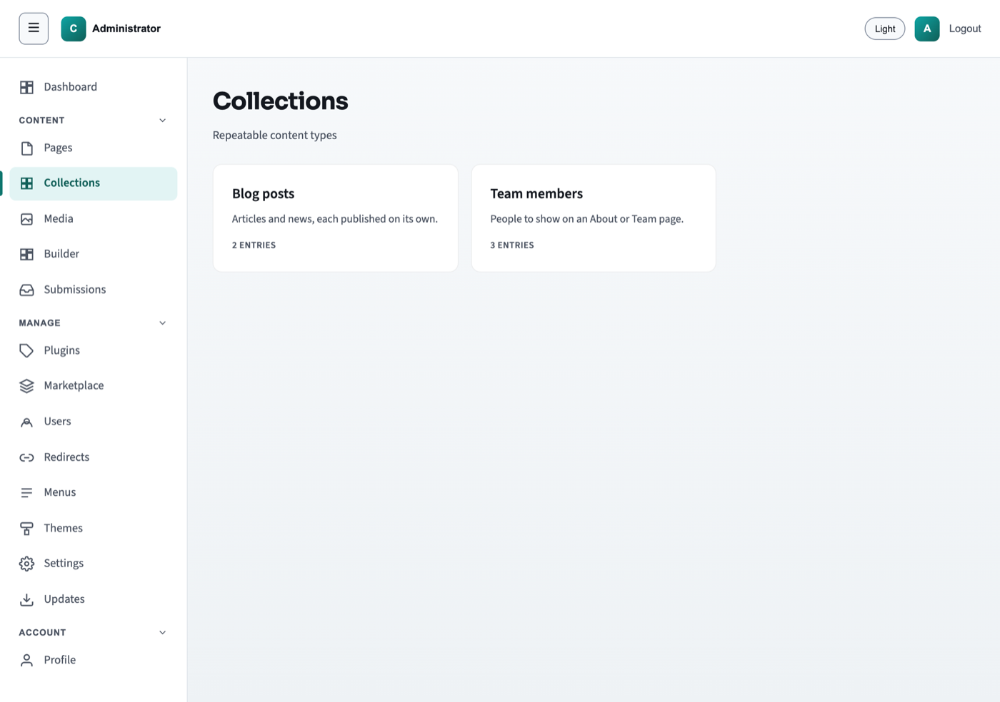

# Collections

The word "collection" does not explain itself, and this is the part of the admin
people most often get wrong. It is worth ten minutes, because once the idea lands
the screens are straightforward.

## What a collection is, and why it is not a page

A **page** is a place. It has an address of its own, you build it section by
section, and you decide where it sits in the navigation. Your About page is a
page. So is Contact. There are not many of them, they are all different, and each
one was put there on purpose.

A **collection** is a set of things that are all the same shape as each other.
Every blog post has a title, a date, a body. Every team member has a name, a role,
a photo. There may be three of them today and ninety in two years, and nobody
wants to build ninety pages by hand — or add ninety items to the navigation.

So the deal is different. You do not build a blog post. You **fill in the same
handful of fields you filled in last time**, and the site puts them where they
belong.

Here is the distinction in the form that matters day to day:

| | A page | A collection entry |
|---|---|---|
| How many | A few, each different | Many, all alike |
| You decide the layout | Yes — you add and arrange sections | No — you fill in fields |
| In the navigation | Yes, if you add it there | No — entries are listed automatically |
| Made by | Building it | Filling in a form |

That third row is the one to hold on to. **A blog post is not something you put in
the menu.** You do not add "Our new workshop bench" to the row of links across
the top of your site, and you would not want to — next month there would be
eleven of them up there. A post is one of many similar things, and the site lists
them for you. What goes in the menu, if anything, is the one page that holds the
listing.

If you find yourself about to build a page for the fifth item of something, stop:
that is a collection.

## The collections screen

Click **Collections** in the left-hand menu. You get one card per kind of thing
your site keeps, with its name, a sentence describing it, and how many entries it
has. Click a card to see its entries.



Which collections you have was decided when your site was built, and there is no
**+ New collection** button — a new *kind* of thing is a job for whoever looks
after the site, not something you can add here. What you add is entries.

The example site that ships with the CMS has two, and they are worth walking
through because they are different in an instructive way.

## Blog posts

*Articles and news, each published on its own.* Newest first.

| Field | What goes in it |
|---|---|
| **Title** — required | The name of the post. This is what shows in the entries list, and it is what the address is worked out from. |
| **Author** | Points at one of your **Team members**. See [References](#references) below. |
| **Date** | The date of the post. This is also what the list is sorted by, newest first. |
| **Excerpt** | *A short summary shown in listings.* One or two sentences. Where a listing shows a taste of each post rather than the whole thing, this is the taste. |
| **Cover image** | The picture that represents the post. Picked from your [media library](pictures.md). |
| **Body** — required | The post itself, with formatting — headings, bold, links, lists. This uses the same toolbar as a page's text: see [the rich-text toolbar](editing.md#formatting-text). |
| **Related posts** | Points at other **Blog posts** — as many as you like, in an order you choose. |

## Team members

*People to show on an About or Team page.* No particular order; the most recently
edited come first.

| Field | What goes in it |
|---|---|
| **Name** — required | The person's name. This is what shows in the entries list, and what other entries see when they point at this one. |
| **Role** | Their job title, in whatever words your site uses. |
| **Photo** | Their photograph, picked from your media library. |
| **Bio** | A short plain-text description. No formatting here — it is a plain box, not a rich-text one. |

Notice how the two differ. A team member is a small, flat record: four fields,
none of them pointing anywhere else, and no date. A blog post is a document with a
publication date, a formatted body, and two fields that **point at other
entries**. Same idea, very different weight — which is why "collection" is a word
about shape rather than about blogging.

## References

Two of the blog post fields — **Author** and **Related posts** — do not ask you to
type anything. They ask you to point at something that already exists.

**Author** offers you a list of your team members, and you pick one. You are not
typing "Mara Ellis" into a box; you are saying *this post's author is that person
over there*. The difference matters in three ways:

- **You cannot get it wrong.** No misspelling, no "Mara Elis" on one post and
  "Mara Ellis" on another.
- **If that thing changes, the link follows it.** Correct a team member's name or
  swap their photo once, and every post that points at them shows the new version.
  You do not go round the posts fixing them.
- **It is a real connection, not a coincidence.** The site knows those posts
  belong to that person, which is what lets it do something with the fact.

**Related posts** works the same way but holds several. You add posts one at a
time from a list, each one appearing as a small labelled item. Beside each is an
up arrow, a down arrow and a cross, so you can put them in the order you want and
take one out again. **The order you choose is the order they are delivered in**, so
put the most relevant first. A post already in the list is not offered again, so
you cannot add the same one twice.

An empty reference field is fine. A post with no author and no related posts is a
perfectly valid post.

### When the thing you pointed at goes away

Nothing stops somebody deleting a team member that posts point at, and the CMS
does not pretend otherwise. What happens is this:

- The reference is left pointing at something that is not there. Where the entry
  editor would normally show a name, it shows the missing item's address followed
  by **(missing)**.
- **Your entry is still valid and still saves.** A post does not become
  unsaveable because its author was deleted — you would then have a post you
  could not fix, which is worse than the problem.
- On the public side, a reference to something that is not published does not
  resolve at all. Visitors are never shown the existence of unpublished work.

So if you see *(missing)* against a reference, somebody removed what it pointed
at. Pick a replacement or clear the field.

### Referenced by

At the bottom of an entry's editor there is a **Referenced by** panel, which
appears only when something points **at** this entry. Open a team member and it
lists the posts that name them as author.

It is there to answer "what will I break?" before you delete something. It does
not stop you deleting — read it, then decide.

## Working with entries

Click a collection card and you get its entries, newest or most-recently-edited
first depending on the collection. Each row shows the entry's title, its address
underneath, a badge saying where it stands, and **Edit** and **Delete** buttons.
**+ New entry** starts one.

Unlike the Pages list there are no filter tabs and no search here — it is one
straight list.

### Making a new entry

**+ New entry** gives you an empty form with the collection's fields, plus one
extra box at the top: **Slug**, marked *Optional — derived from the title if left
blank*. The slug is the entry's own address. Leave it empty and the site works one
out from the title, which is almost always what you want.

**The slug box appears only while you are creating.** Once the entry exists its
address is fixed and there is no field for it — the same reasoning as with pages,
and for the same reason: an address that changes breaks every link anybody saved.

Fill in the fields. The ones with a **red asterisk** are required, and the entry
will not save without them — you will get a message against the field naming it,
in the same way a page does. See
[Required fields](editing.md#required-fields-and-the-red-asterisk).

Then **Save**. And then, separately:

## Publishing an entry

Entries publish independently, and saving is not publishing here either.

This works exactly as it does for pages, and it catches people in exactly the same
way.

**Save** keeps your work in the admin. **Publish** puts that one entry in front of
the public. Every entry has its own state, quite independent of every other entry
and of any page. Publishing one post does not publish the next.

The badge on an entry says where it stands:

| Badge | Meaning |
|---|---|
| **Draft** | Never published. Nobody outside the admin has seen it. |
| **Live** | Published, and what the public has matches what is here. |
| **Unpublished changes** | Published, but you have saved edits since that are not out yet. |
| **Taken down** | Published once, then withdrawn. |

The strip at the top of the entry editor carries the buttons: **Publish** — or
**Publish changes** when there are saved edits waiting — and **Unpublish**, which
withdraws the entry from the public site without deleting anything. The wording is
slightly different from the page editor, which says *Take down* for the same
action; the resulting badge is the same.

The messages are plain about it. After saving: *Saved. This is not on the public
site until you publish.* After publishing: *Published. This entry is now on the
public site.*

Everything else you rely on with pages is here too:

- **Version history**, below the fields, with every save timestamped and a
  **Restore** button on the older ones. Restoring changes your working copy, not
  the live entry — *the live entry is unchanged until you publish*.
- **Delete**, which is the one that is not easily undone. It asks *Delete this
  entry? This cannot be undone.* If you want an entry off the public site but
  kept, **Unpublish** it instead.

What is *not* here is a comments box. Pages have one for leaving a note to
whoever reviews them; entries do not.

### Looking at an entry before it is published

Put `/preview/` in front of the address the entry will have, and open it while
you are signed in. A post destined for `/blog/its-name` is readable now at
`/preview/blog/its-name`, rendered as a visitor would see it, showing what you
last saved. Signed out, that address answers *page not found*.

This is the answer for an **author**, who can write an entry and not publish it:
save, and send that address to whoever approves. The full explanation, including
what the entry editor's own **Preview** button does instead — it hands back the
entry as data, for a separate website rather than for reading — is in
[Showing an unpublished entry to somebody](publishing.md#showing-an-unpublished-entry-to-somebody).

If your account cannot publish — see
[What your account can do](roles.md#author) — the publishing buttons are not
there, and the strip tells you to ask. Save, and say it is ready.

## Where entries appear on the public site

Two things have to be true for a visitor to read one of your entries: something
has to **list** it, and it needs an **address** of its own. Both are settings, and
on the example site both are already switched on for blog posts.

### The listing

There is a section design called **Collection list**. Put it on a page, choose
which collection it should show, and it lists the published entries — each one's
title, its summary, its picture, linked to the entry itself.

It has five settings, and only one of them is required:

| | |
|---|---|
| **Heading** | Optional words above the list |
| **Introduction** | Optional, a sentence or two under the heading |
| **Collection** | **Required.** Which one to list — *Blog posts* or *Team members* |
| **How many entries** | The newest ones, up to this many. Six by default, fifty at the most |
| **Order** | The collection's own order, newest first, oldest first, or by title. *Newest* and *oldest* go by when an entry was last edited; the collection's own order is what it declares for itself, which for blog posts is their date |

On the example site the **Journal** page carries one, which is why publishing a
post makes it appear there without you touching the page.

If no entries are published yet, the section renders **nothing at all** — not an
empty heading. A page that is not ready simply looks unfinished rather than
broken.

### The address

A collection can have its own stretch of the site. *Blog posts* ships with one,
so a published post is readable at:

```
/blog/why-we-stopped-staining
```

That comes from the collection's own definition — an administrator or developer
sets it once, in `config/collections/post.json`, and every post in that
collection is addressed under it from then on.

**A collection with no address set is admin-only.** *Team members* is deliberately
that: the people appear in a section on the About page, and there is no
`/team-member/jun-park` for a visitor to find. That is usually what you want for
a collection that exists to be shown *inside* other pages.

### What you can rely on

- **A draft is never readable at its own address.** An unpublished entry there
  returns "page not found" — the same response as an address that never existed,
  so nobody can tell from the outside that a draft is there at all. The
  [`/preview/` address](#looking-at-an-entry-before-it-is-published) is the one
  deliberate exception, and it opens only for somebody signed in.
- **A page always wins.** If a page and a collection ever want the same address,
  the page keeps it. Turning on an address for a collection can never take a URL
  away from a page you already have.
- **Your language prefix works as it does everywhere.** `/de/blog/…` behaves like
  `/de/…` does for a page, including falling back to the default language when
  there is no translation yet.

## Quick answers

**I published a post and the site looks the same.** Check the badge says *Live*.
If it does, check the page you expected it on actually carries a **Collection
list** section pointing at the right collection — that is what does the listing.

**I want a post in the top navigation.** You almost certainly do not, and a
collection entry is not something the menu can point at. What goes in the menu is
the page that holds the listing, and adding it there is an administrator's job —
see [Menus](admin-tour.md#menus).

**The Author dropdown is empty.** There are no team members yet. Add one under
**Team members** first, then come back.

**A reference says (missing).** What it pointed at has been deleted. Pick
something else, or clear the field.

**Can I add a new field to blog posts?** Not from the admin. The shape of a
collection is set up by whoever built the site.

**Can I make a new collection?** Not from the admin, for the same reason. There is
no button for it, which is the screen telling you so rather than hiding it.
