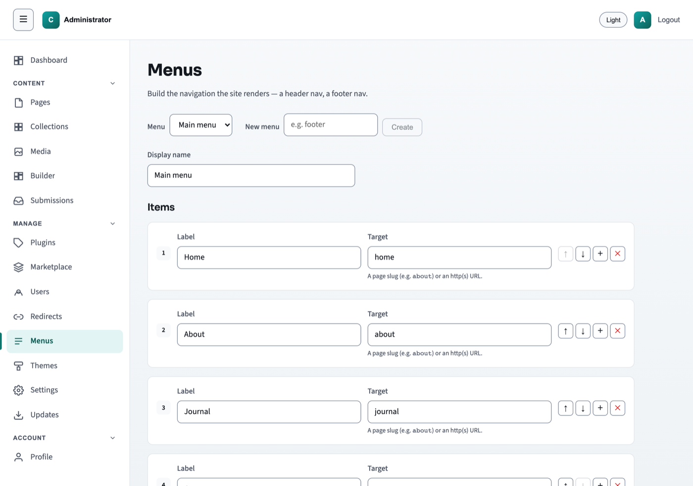

# Getting started

This page is for the person who looks after a finished website — not the person
who built it. If someone has handed you a site and said "you can edit it
yourself now", start here. You will not need to install anything, and you will
not need to type a single command.

The screen where you make changes is called the **admin**. Everyone else on the
internet sees the **public site**. The two are separate, and nothing you type in
the admin reaches the public site until you decide it should. That is the
safety net under everything that follows.

## What you need before you start

- **The web address of your admin.** It is your site's address with `/admin/` on
  the end — for example `https://your-site.com/admin/`.
- **A username and a password.** Whoever built the site gives you these.
- **A web browser.** The one you already use is fine.

## Sign in

Open the admin address. You will see a small box with two fields.

1. Type your username in **Username**.
2. Type your password in **Password**.
3. Click **Sign In**.

If the details are wrong, the screen stays where it is and tells you so. Try
again — nothing is locked or broken by a mistyped password.

## Choose your own password

The very first time you sign in, you are asked to set a new password. This step
cannot be skipped, and it is worth knowing why: a brand-new site is installed
with a password that is printed in this documentation, so until you change it,
it is not a secret from anyone.

1. Put the password you signed in with into **Current password**.
2. Type a new one into **New password**. It needs at least 8 characters.
3. Type the same new one into **Repeat new password**.
4. Click **Set password**.

You are then taken to the dashboard. Use your new password from now on. You can
change it again later from **Profile**, at the bottom of the left-hand menu.

## The dashboard

This is the first screen after signing in. It is a summary, not a place where
you change anything.

The counts mean:

- **Total Pages** — how many pages exist in the admin, live or not.
- **Live** — how many of them the public can see right now.
- **Edits pending** — pages where you have saved changes that are not on the
  public site yet. A page can be live and have pending edits at the same time.
- **Active Plugins** — extra features switched on for your site. Whoever built
  the site set these up.

## The menu down the left

The menu is grouped. Most days you will only use the **Content** group.

**Dashboard** — the summary screen above.

### Content

- **Pages** — the pages of your site: your home page, About, Contact. This is
  where you go to change wording or a picture.
- **Collections** — things you have lots of that all look alike, such as blog
  posts or team members.
- **Media** — your pictures. Everything you upload lands here, and sections pick
  from it.
- **Builder** — a freer way of laying out a page. You do not need it to change
  text or swap a photo.
- **Submissions** — where things people send through a form on your site arrive.

### Manage

You can leave this whole group alone unless you know you need it.

- **Plugins** and **Marketplace** — extra features, and the list you can add
  more from.
- **Users** — who else is allowed to sign in.
- **Redirects** — sends an old web address to a new one, so an old link still
  works.
- **Menus** — the row of links across the top of your public site.
- **Themes** — the overall look: colours, fonts, spacing.
- **Settings** — settings that apply to the whole site.
- **Updates** — keeps the software itself current. Usually the job of whoever
  built the site.

### Account

- **Profile** — your own account, including your password.

At the top right there is a **Light** / **Dark** switch, which changes how the
admin looks to you and nothing else, and **Logout**.

## Collections, in plain terms

A collection is a set of items that share a shape. Every blog post has a title,
a date and a body; every team member has a name, a role and a photo. Rather than
building each one as its own page, you fill in the same handful of fields each
time and the site lays them out for you.

Which collections you have depends on how your site was built. If you only ever
need to change wording on an existing page, you may never open this screen.

## Menus, in plain terms

The menu is the row of links across the top of your public site. Each item has a
**Label** — the words a visitor reads — and a **Target**, which is where the
link goes.

Adding a page to your site does not add it to the menu. If you want a new page
to appear up there, add an item here as well.

## Before you change anything

Three things worth knowing early, because they take the fear out of the rest:

- **Saving is not publishing.** Your changes sit in the admin until you publish
  them. You can save halfway through a sentence and go to lunch.
- **Every save is kept.** Each page has a version history with a timestamp for
  every save, and a **Restore** button on the older ones. A mistake you saved an
  hour ago is not lost.
- **You can look before anyone else does.** The **Preview** button shows you the
  page as it will be.

The one action that is not easily undone is **Delete** on a page. If you want a
page off the public site but kept, take it down instead — that is covered in
[Publishing your changes](publishing.md).

## Next

Go to [Editing a page](editing.md) to change your first piece of text.
