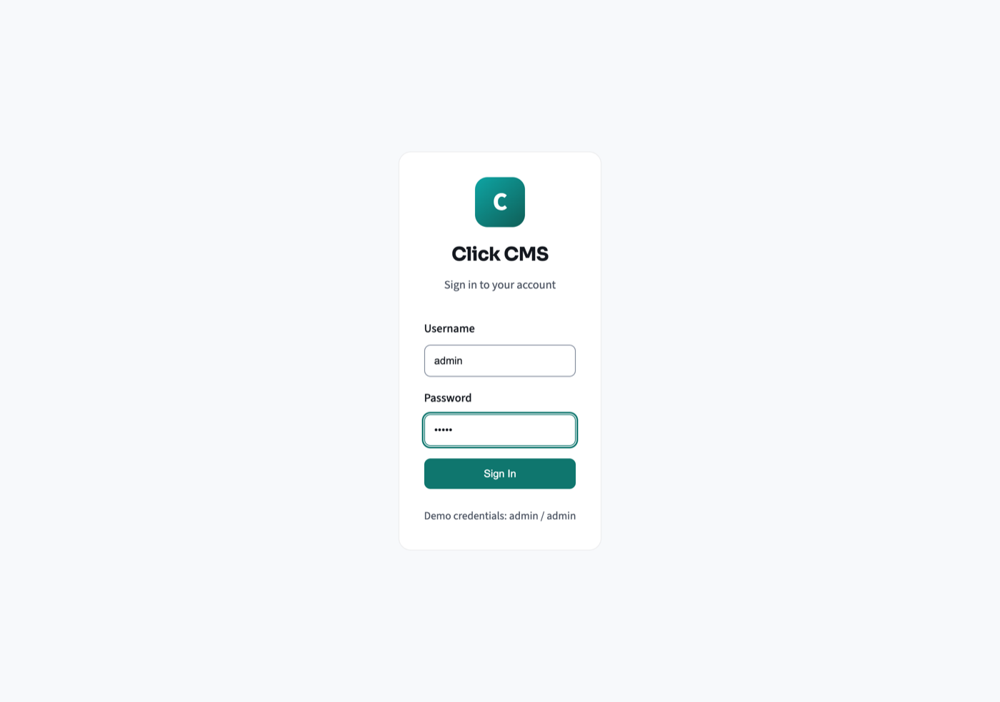
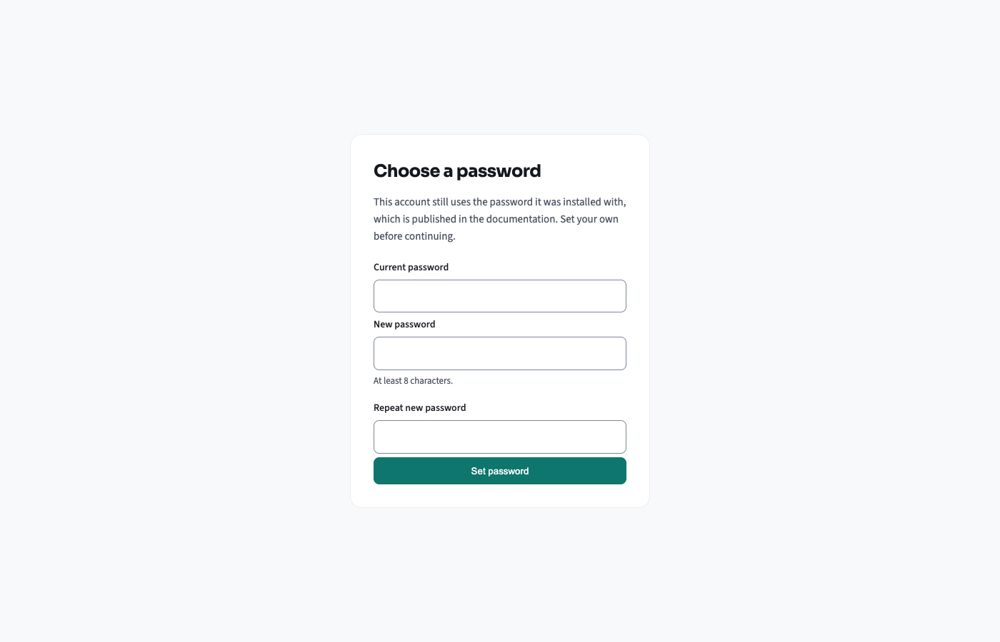
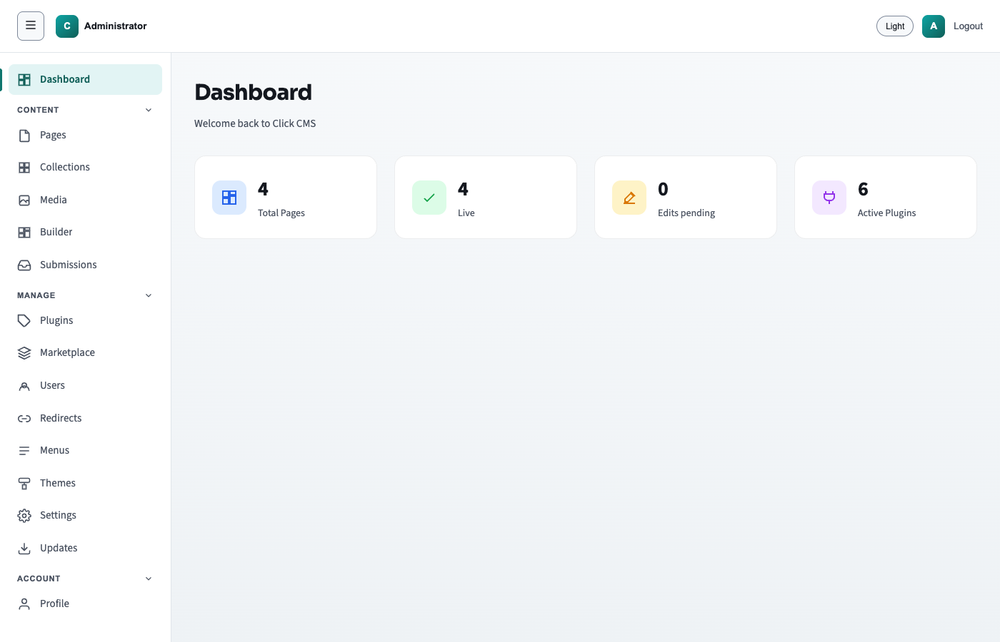

# Getting started

This page is for the person who looks after a finished website — not the person
who built it. If someone has handed you a site and said "you can edit it
yourself now", start here. You will not need to install anything, and you will
not need to type a single command.

The screen where you make changes is called the **admin**. Everyone else on the
internet sees the **public site**. The two are separate, and nothing you type in
the admin reaches the public site until you decide it should. That is the
safety net under everything that follows.

## What you need before you start

- **The web address of your admin.** It is your site's address with `/admin/` on
  the end — for example `https://your-site.com/admin/`.
- **A username and a password.** Whoever built the site gives you these.
- **A web browser.** The one you already use is fine.

## Sign in

Open the admin address. You will see a small box with two fields.

1. Type your username in **Username**.
2. Type your password in **Password**.
3. Click **Sign In**.

If the details are wrong, the screen stays where it is and tells you so. Try
again — nothing is locked or broken by a mistyped password.

If you cannot get in at all, the two usual causes are an address without the
`/admin/` on the end, and a username that is not what you assumed — it is a
username, not your email address. Whoever built the site can look up the first
and confirm the second. Nobody can look up your password, so if it is genuinely
lost, the answer is a new account rather than a reminder.

## Choose your own password

The very first time you sign in, you are asked to set a new password. This step
cannot be skipped, and it is worth knowing why: a brand-new site is installed
with a password that is printed in this documentation, so until you change it,
it is not a secret from anyone.

1. Put the password you signed in with into **Current password**.
2. Type a new one into **New password**. It needs at least 8 characters.
3. Type the same new one into **Repeat new password**.
4. Click **Set password**.

You are then taken to the dashboard. Use your new password from now on.

Until you have done this, the admin will let you reach nothing else — not because
you have done anything wrong, but because an account still using its installed
password is not really protected at all.

To change it again later, put `/admin/password` on the end of your site's address
— so `https://your-site.com/admin/password`. It is the same screen, and it is not
listed in the menu, so it is worth noting down.

## The dashboard

This is the first screen after signing in. It is a summary, not a place where
you change anything.

The counts mean:

- **Total Pages** — how many pages exist in the admin, live or not.
- **Live** — how many of them the public can see right now.
- **Edits pending** — pages where you have saved changes that are not on the
  public site yet. A page can be live and have pending edits at the same time.
- **Active Plugins** — extra features switched on for your site. Whoever built
  the site set these up.

## The menu down the left

The menu is grouped, and the groups are audiences rather than topics. Most days
you will only use the **CONTENT** group:

- **Pages** — the pages of your site: your home page, About, Contact. This is
  where you go to change wording or a picture, and where you will spend nearly
  all your time.
- **Collections** — things you have lots of that all look alike, such as blog
  posts or team members.
- **Media** — your pictures and video. Everything you upload lands here, and
  pages pick from it.
- **Submissions** — where messages people send through a form on your site
  arrive.

Above them is **Dashboard**, the screen described above. Below them, under
**ACCOUNT**, is **Profile**. You may also see **Builder** in the Content group,
and a whole **MANAGE** group of eight further items — whether you do depends on
what kind of account you have.

Every item, in order, with what it is for and whether you are ever likely to
need it, is in [What everything in the menu does](admin-tour.md). Read it once
and the menu stops being a row of unknowns.

**If a colleague's screen has a MANAGE heading and yours does not**, nothing is
broken: your account is a different kind from theirs.
[What your account can do](roles.md) explains the four kinds, how to tell which
is yours, and what each one may and may not do. It is the fastest way to make
sense of a missing button.

At the top right there is a **Light** / **Dark** switch, which changes how the
admin looks to you and nothing else, and **Logout**.

## Before you change anything

Three things worth knowing early, because they take the fear out of the rest:

- **Saving is not publishing.** Your changes sit in the admin until you publish
  them. You can save halfway through a sentence and go to lunch.
- **Every save is kept.** Each page has a version history with a timestamp for
  every save, and a **Restore** button on the older ones. A mistake you saved an
  hour ago is not lost.
- **You can look before anyone else does.** The **Preview** button shows you the
  page as it will be, and gives you a link you can send to somebody else without
  publishing anything.

The one action that is not easily undone is **Delete** on a page. If you want a
page off the public site but kept, take it down instead — that is covered in
[Publishing your changes](publishing.md).

## Next

In the order most people want them:

1. [What your account can do](roles.md) — which of the four kinds of account you
   have, and what that means. Short, and it explains most surprises.
2. [What everything in the menu does](admin-tour.md) — every item in the
   left-hand menu, named and explained.
3. [Editing a page](editing.md) — change your first piece of text.

Or go straight to [Editing a page](editing.md) if you would rather learn by
doing. Nothing you can do there is unrecoverable.
