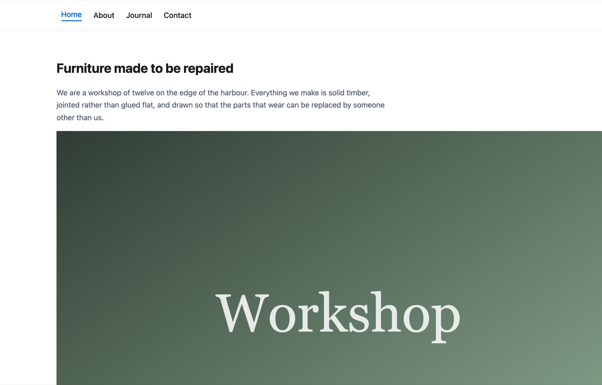

# Publishing your changes

This is the page to read carefully, because it holds the one idea that catches
everybody out.

## Saving is not publishing

**Save** keeps your work. **Publish** shows it to the world. They are two
separate actions, and doing the first does not do the second.

Think of it as a shop window. Saving is writing a new price card at the counter:
it exists, it is safe, nobody outside has seen it. Publishing is walking over
and putting it in the window.

This is why a page can be live and out of date at the same time — the public
sees the last version you published, while your newer saved edits wait. The
Pages list has a tab for exactly those pages: **Edits pending**.

It also means you can save an unfinished sentence, close your laptop, and come
back tomorrow without anyone seeing a half-written page.

## Preview before you publish

At the bottom of the editor are **Cancel**, **Preview** and **Save**.

**Preview** shows you the page as it will be, without publishing anything. Use
it whenever you have changed a layout, added a section, or swapped a picture —
it costs nothing and it is the cheapest way to catch a mistake.

## The banner at the top of the page

Open any page and the banner across the top tells you where it stands. There are
three states worth recognising:

- **Green — "Published — the public site matches what is here."** Nothing is
  waiting. What you are looking at is what visitors see. The banner also has a
  link that opens the live page in a new tab, and a **Take down** button.
- **Not published, nothing saved yet.** A new page you have not saved. Save it
  first; saving still does not publish it.
- **Saved, with changes not yet published.** Your edits are safe but private,
  and the page is in the *Edits pending* tab.

Read this banner when you arrive and again before you leave. It answers "did
that actually go live?" better than anything else on the screen.

## Publish a page

1. **Save** first. There is nothing to publish until you have.
2. Publish the page from the banner at the top of the editor — that strip is
   where a page is put live and taken down again.
3. The banner turns green and says the public site matches what is here.

To be sure, use the link in the green banner to open the live page in a new tab.

If your account is not allowed to publish, the banner says so and asks you to
tell an editor. That is not an error: some sites are set up so that one person
writes and another approves. Save your work, leave a note in the comments box
(below), and tell them it is ready.

## Look at the result

Then look at it on a phone. More than half of most visitors arrive on one, and
the layout rearranges itself to fit.

## Taking a page down

**Take down**, in the banner, removes a page from the public site. Visitors stop
seeing it.

It is not a delete. The page, its content and its history all stay in the admin,
and it appears under the **Taken down** tab in the Pages list. Take a page down
when an offer has ended or the details have gone stale and you would rather show
nothing than something wrong.

**Delete**, on the Pages list, is the one that removes the page itself. Take
down first, and delete only when you are certain.

## Undoing a mistake with version history

Below the Save button is **Version history**, and it is the reason you can afford
to be brave.

Every save is listed with the date and time it happened. The newest entry is
marked **WORKING COPY** — what is in the editor now — and the one you last saved
is marked **SAVED**. Every older entry has a **Restore** button.

To go back:

1. Find the entry from before the mistake, using the timestamps.
2. Click **Restore**.
3. Look at the page. **Preview** it if you want to be sure.
4. If it is right and the page is live, publish it to put the older version back
   on the public site.

Two things make this safe, and the panel says both:

- **Restoring changes your working copy, not the live page.** The public keeps
  seeing whatever is published until you publish again. You can restore, look,
  and change your mind without a visitor ever noticing.
- **The restore is itself recorded as a new version**, so it can be undone the
  same way. There is no last chance to get wrong.

## Leaving a note

Near the version history there is a **comments** box. Use it to leave a note for
whoever reviews the page — "new opening hours, confirmed with Mara", or "photo
still to come". It is a message to a colleague, not something visitors see.

## Quick answers

**I saved but the site has not changed.** Saving is not publishing. Open the
page and check the banner at the top.

**I published and my browser still shows the old page.** Reload the page. If it
is still old after a minute or two, tell whoever looks after the site — there
are caches that can hold an old copy.

**I published something wrong, right now.** Take the page down first, so nobody
sees it while you sort it out. Then restore the earlier version from version
history and publish that.

**I edited the wrong page.** Cancel if you have not saved. If you have saved,
restore the version from before your edit — and note that you have not made
anything public by saving.

**Where do I check what is waiting?** The **Edits pending** tab on the Pages
list, and the *Edits pending* count on the dashboard.
